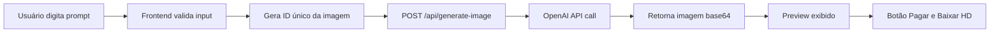
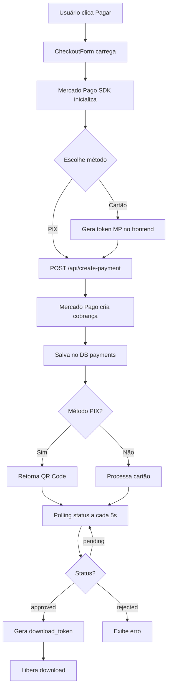
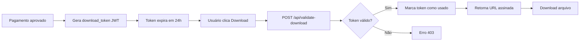

# AGENT.md - PIX Reveal Cake Topper Generator

## 📋 Visão Geral do Projeto

**Nome**: PIX Reveal Cake Topper Generator
**Tipo**: Aplicação Web SaaS - Gerador de Toppers de Bolo com IA
**Stack Principal**: Next.js 15 + React 18 + TypeScript + Supabase + AbacatePay
**Modelo de Negócio**: Freemium - Geração gratuita + Pagamento PIX para download HD (R$ 1,00)
**Status**: Production-ready ✅

---

## 🎯 Propósito

Aplicação web que permite usuários gerarem toppers de bolo personalizados usando inteligência artificial (OpenAI). O usuário pode criar designs únicos gratuitamente (preview), mas precisa pagar via PIX para baixar a versão em alta qualidade. Integração completa com sistema de pagamentos AbacatePay.

---

## 🏗️ Arquitetura do Sistema

### Stack Tecnológica

#### Frontend

- **Framework**: Next.js 15.4.6 (App Router)
- **Runtime**: Node.js v20.11.1
- **UI Library**: React 18.3.1
- **Linguagem**: TypeScript 5.5.3
- **Estilização**: Tailwind CSS 3.4.11 + shadcn/ui
- **Componentes**: Radix UI (headless components)
- **Ícones**: Lucide React + LordIcon (animados)
- **Estado**: React Query (@tanstack/react-query 5.56.2)
- **Formulários**: React Hook Form 7.53.0 + Zod 3.23.8
- **Notificações**: Sonner 1.5.0
- **PWA**: Service Worker customizado + Manifest

#### Backend

- **API Routes**: Next.js API Routes (serverless)
- **Banco de Dados**: Supabase PostgreSQL
- **Edge Functions**: Supabase Edge Functions (Deno)
- **Autenticação**: Sem autenticação (uso anônimo)
- **Storage**: Supabase Storage (para imagens geradas)

#### Integrações Externas

- **IA**: OpenAI API (image generation)
- **Pagamentos**: AbacatePay SDK (abacatepay-nodejs-sdk)
- **Infraestrutura**: Supabase (BaaS)

#### DevOps & Testing

- **Testes E2E**: Playwright 1.54.2
- **Linting**: ESLint 9.9.0
- **CI/CD**: Via Lovable + GitHub
- **Monitoramento**: Health checks customizados

---

## 📂 Estrutura de Diretórios

```text
/
├── app/                          # Next.js App Router
│   ├── [[...slug]]/             # Catch-all route (Next migration)
│   │   ├── page.tsx             # Página principal
│   │   └── client.tsx           # Client component wrapper
│   ├── api/                     # API Routes (Next.js)
│   │   ├── create-payment/      # Criar pagamento MP
│   │   ├── generate-image/      # Gerar imagem com OpenAI
│   │   ├── health/              # Health check detalhado
│   │   ├── healthz/             # Health check simples
│   │   ├── mp-webhook/          # Webhook do Mercado Pago
│   │   ├── payment-status/      # Consultar status de pagamento
│   │   ├── validate-download/   # Validar token de download
│   │   └── revalidate/          # Revalidação de cache
│   ├── layout.tsx               # Root layout
│   └── register-sw.tsx          # Registro do Service Worker
│
├── src/                         # Source code (React legacy)
│   ├── components/              # Componentes React
│   │   ├── ui/                  # shadcn/ui components (40+ componentes)
│   │   ├── CakeTopperGenerator.tsx  # Componente principal
│   │   ├── CheckoutForm.tsx     # Formulário de pagamento
│   │   ├── LordIcon.tsx         # Wrapper para ícones animados
│   │   ├── OfflineIndicator.tsx # Indicador de status offline
│   │   ├── PromptCatalog.tsx    # Catálogo de prompts pré-prontos
│   │   └── PWAInstallPrompt.tsx # Prompt instalação PWA
│   │
│   ├── constants/               # Constantes da aplicação
│   │   ├── app.ts               # Mensagens e validações
│   │   ├── prompts.ts           # Catálogo de prompts (8 categorias)
│   │   ├── styles.ts            # Estilos customizados
│   │   └── index.ts             # Exportações
│   │
│   ├── hooks/                   # Custom React Hooks
│   │   ├── useImageGeneration.ts  # Geração de imagens
│   │   ├── usePayment.ts        # Gerenciamento de pagamentos
│   │   ├── use-mobile.tsx       # Detecção de mobile
│   │   └── use-toast.ts         # Toast notifications
│   │
│   ├── services/                # Serviços de API
│   │   ├── imageGenerator.ts    # Client para API de imagens
│   │   └── paymentService.ts    # Client para API de pagamentos
│   │
│   ├── integrations/
│   │   └── supabase/
│   │       ├── client.ts        # Cliente Supabase
│   │       └── types.ts         # Tipos do banco
│   │
│   ├── lib/
│   │   └── utils.ts             # Utilitários (cn helper)
│   │
│   ├── pages/                   # Páginas (legacy)
│   │   └── Index.tsx            # Página inicial
│   │
│   ├── routes/                  # Rotas (legacy)
│   │   ├── Index.tsx
│   │   └── NotFound.tsx
│   │
│   ├── assets/                  # Assets estáticos
│   │   ├── cake-topper-example.jpg
│   │   └── icons/
│   │
│   ├── index.css                # Estilos globais + CSS variables
│   └── main.tsx                 # Entry point React (legacy)
│
├── supabase/                    # Supabase config
│   ├── config.toml              # Configuração local
│   ├── functions/               # Edge Functions (Deno)
│   │   ├── _shared/
│   │   │   └── cors.ts
│   │   ├── create-payment/
│   │   ├── generate-image/
│   │   ├── mp-webhook/
│   │   ├── payment-status/
│   │   └── validate-download/
│   └── migrations/
│       └── 20250109000000_add_payments_system.sql
│
├── public/                      # Assets públicos
│   ├── manifest.json            # PWA manifest
│   ├── sw.js                    # Service Worker
│   ├── robots.txt
│   └── pwa-icons/               # Ícones PWA
│
├── tests/
│   └── smoke.spec.ts            # Testes E2E básicos
│
├── package.json                 # Dependências npm
├── next.config.mjs              # Configuração Next.js
├── tailwind.config.ts           # Configuração Tailwind
├── tsconfig.json                # Configuração TypeScript
├── eslint.config.js             # Configuração ESLint
└── postcss.config.js            # Configuração PostCSS
```

---

## 🔄 Fluxo de Funcionamento

### 1. Geração de Imagem (Gratuita)



**Componente**: `CakeTopperGenerator.tsx`
**Hook**: `useImageGeneration.ts`
**API**: `/app/api/generate-image/route.ts`
**IA**: OpenAI GPT-Image-1 (1024x1024, high quality)

### 2. Sistema de Pagamentos



**Componentes**: `CheckoutForm.tsx`
**Hook**: `usePayment.ts`
**Service**: `paymentService.ts`
**SDK**: `lib/abacatepay.ts` (AbacatePay Client)
**APIs**:

- `/app/api/create-payment/route.ts`
- `/app/api/payment-status/route.ts`
- `/app/api/abacate-webhook/route.ts` (webhook assíncrono)

### 3. Download Seguro



**API**: `/app/api/validate-download/route.ts`
**Segurança**: Token uso único + expiração + rate limiting

---

## 🗄️ Banco de Dados (Supabase PostgreSQL)

### Schema

#### Tabela: `payments`

```sql
- id: UUID (PK)
- image_id: TEXT (ID da imagem gerada)
- external_reference: TEXT UNIQUE (referência interna)
- amount: DECIMAL(10,2)
- currency: TEXT (default 'BRL')
- status: TEXT (pending, approved, rejected, cancelled)
- payment_method_id: TEXT (pix, visa, master, etc)
- payment_type_id: TEXT (bank_transfer, credit_card)
- installments: INTEGER
- payer_email: TEXT
- payer_document_type: TEXT (CPF/CNPJ)
- payer_document_number: TEXT
- description: TEXT
- mp_payment_id: BIGINT UNIQUE
- mp_status: TEXT
- mp_status_detail: TEXT
- mp_date_approved: TIMESTAMPTZ
- mp_date_created: TIMESTAMPTZ
- mp_date_last_updated: TIMESTAMPTZ
- created_at: TIMESTAMPTZ
- updated_at: TIMESTAMPTZ (auto-update via trigger)
```

#### Tabela: `download_tokens`

```sql
- id: UUID (PK)
- payment_id: UUID (FK -> payments.id)
- image_id: TEXT
- token: TEXT UNIQUE
- expires_at: TIMESTAMPTZ (24h após criação)
- used_at: TIMESTAMPTZ (marca uso único)
- ip_address: TEXT
- user_agent: TEXT
- created_at: TIMESTAMPTZ
```

#### Tabela: `payment_logs`

```sql
- id: UUID (PK)
- payment_id: UUID (FK -> payments.id)
- event_type: TEXT (created, webhook_received, status_changed, download_granted)
- event_data: JSONB
- ip_address: TEXT
- user_agent: TEXT
- created_at: TIMESTAMPTZ
```

### Row Level Security (RLS)

- **Payments**: Permite insert anônimo (checkout), full access service_role
- **Download Tokens**: Permite select anônimo para tokens válidos e não usados
- **Payment Logs**: Apenas service_role

### Índices

- `idx_payments_external_reference`
- `idx_payments_mp_payment_id`
- `idx_payments_image_id`
- `idx_payments_status`
- `idx_download_tokens_token`
- `idx_download_tokens_expires_at`
- `idx_download_tokens_image_id`
- `idx_payment_logs_payment_id`
- `idx_payment_logs_event_type`

---

## 🔐 Segurança Implementada

### 1. **Validação de Download**

- Token JWT temporário (24h)
- Hash da imagem para verificar integridade
- URLs assinadas com expiração automática
- Sistema de uso único por token
- IP e User-Agent logging

### 2. **Proteção contra Fraudes**

- Rate limiting por IP (5 tentativas/minuto)
- Logs de auditoria completos
- Validação de status via webhook do MP
- Tokens criptografados
- Binary mode no MP (aprovado/rejeitado, sem pendências)

### 3. **Conformidade PCI DSS**

- Dados de cartão processados APENAS pelo Mercado Pago
- Nenhum dado sensível armazenado localmente
- Comunicação criptografada (HTTPS obrigatório)
- Tokens seguros para transações
- SDK oficial do MP para tokenização

### 4. **Proteção de Dados Pessoais**

- Sem autenticação = sem dados pessoais persistidos
- CPF/email salvos apenas para transação
- Webhook validado com idempotência
- Logs de acesso para auditoria

---

## 🎨 Design System

### Tema Principal

- **Cores primárias**: Rosa (#e91e63), Roxo (#9c27b0)
- **Cores secundárias**: Azul (#2196f3), Verde (#4caf50)
- **Gradientes**: Hero, Primary, Accent, Subtle, Card
- **Fontes**: Inter (sans-serif), Playfair Display (serif)

### Componentes shadcn/ui (40+)

Accordion, Alert, Alert Dialog, Aspect Ratio, Avatar, Badge, Breadcrumb, Button, Calendar, Card, Carousel, Chart, Checkbox, Collapsible, Command, Context Menu, Dialog, Drawer, Dropdown Menu, Form, Hover Card, Input, Input OTP, Label, Menubar, Navigation Menu, Pagination, Popover, Progress, Radio Group, Resizable, Scroll Area, Select, Separator, Sheet, Sidebar, Skeleton, Slider, Sonner, Switch, Table, Tabs, Textarea, Toast, Toggle, Toggle Group, Tooltip

### Animações Customizadas

- `fade-in`: Fade com translateY
- `pulse-slow`: Pulse suave
- `shimmer`: Efeito shimmer
- `bounce-soft`: Bounce delicado

### Responsividade

- Breakpoints: xs (375px), sm (640px), md (768px), lg (1024px), xl (1280px), 2xl (1536px)
- Mobile-first approach
- PWA otimizado para mobile

---

## 💰 Configuração de Preços

### Valores Atuais

- **Preço por imagem**: R$ 1,00 (100 centavos - mínimo do AbacatePay)
- **Método aceito**: PIX apenas
- **Configurável em**: `CakeTopperGenerator.tsx:25`

### AbacatePay

- **Ambiente de Desenvolvimento**:
  - API Key: `abc_dev_xf5cGzyzdSWMmHjY2W5uhwZ3`
  - Valor mínimo: R$ 1,00 (100 centavos)
- **Ambiente de Produção**: 
  - API Key: `abc_prod_...` (solicitar upgrade no dashboard)
  - Mesmo valor mínimo

---

## 🌐 Variáveis de Ambiente

### Obrigatórias (Produção)

```bash
# Next.js
NEXT_PUBLIC_SITE_URL=https://seu-dominio.com

# Supabase
NEXT_PUBLIC_SUPABASE_URL=https://xxx.supabase.co
NEXT_PUBLIC_SUPABASE_ANON_KEY=eyJhbG...
SUPABASE_SERVICE_ROLE_KEY=eyJhbG...

# OpenAI
OPENAI_API_KEY=sk-proj-...

# AbacatePay
ABACATE_PAY_API_KEY=abc_prod_... # Produção
```

### Opcionais (Desenvolvimento)

```bash
# Usar credenciais de teste AbacatePay
ABACATE_PAY_API_KEY=abc_dev_xf5cGzyzdSWMmHjY2W5uhwZ3
```

---

## 📱 Progressive Web App (PWA)

### Recursos Implementados

- ✅ **Offline Support**: Service Worker com cache de assets
- ✅ **Install Prompt**: Prompt customizado para instalação
- ✅ **Offline Indicator**: Indicador visual de status de conexão
- ✅ **Manifest.json**: Configurado com ícones e cores
- ✅ **Icons**: 16x16, 72x72, 128x128, 512x512
- ✅ **Theme Color**: #e91e63 (rosa primário)

### Service Worker (`/public/sw.js`)

- Cache de assets estáticos
- Estratégia Network First para API calls
- Cache First para assets públicos
- Fallback para offline

### Instalável em

- Chrome/Edge (Android/Desktop)
- Safari (iOS) - Add to Home Screen
- Firefox (Desktop)

---

## 🧪 Testes

### E2E Tests (Playwright)

```bash
npm run test          # Headless
npm run test:ui       # UI mode
npm run test:headed   # Headed mode
npm run test:debug    # Debug mode
```

**Cobertura atual**: Smoke test básico (home page loads)

### Sugestões para Expandir

- [ ] Testar fluxo completo de geração
- [ ] Testar fluxo de pagamento PIX
- [ ] Testar fluxo de pagamento cartão
- [ ] Testar validação de formulários
- [ ] Testar offline behavior
- [ ] Testar responsive design

---

## 📊 Monitoramento & Observabilidade

### Health Checks

#### `/api/healthz` - Simple

```json
{
  "status": "ok",
  "timestamp": "2025-08-23T02:23:33.309Z",
  "uptime": 4495.79,
  "environment": "production"
}
```

**Uso**: Load balancers, probes frequentes
**Tempo de resposta**: ~50ms

#### `/api/health` - Detailed

```json
{
  "status": "healthy",
  "checks": {
    "api": { "status": "ok" },
    "database": { "status": "ok", "responseTime": 38 },
    "openai": { "status": "configured", "apiKey": true },
    "mercadopago": { "status": "configured", "apiKey": true, "publicKey": true },
    "environment": { "nodeEnv": "production", "version": "1.0.0" }
  },
  "memory": { "rss": 515489792, "heapTotal": 516833280, "heapUsed": 473679024 },
  "version": { "node": "v20.11.1", "platform": "darwin" }
}
```

**Uso**: Dashboards, alertas, debugging
**Tempo de resposta**: ~200ms

### Logs Estruturados

Todos os endpoints de API geram logs com:

- Request ID único
- Timestamps precisos
- Duração de operações
- Parâmetros de entrada (sanitizados)
- Erros detalhados com stack traces

**Formato**: `[request_id] Mensagem {contexto_json}`

---

## 🚀 Deploy & CI/CD

### Plataformas Suportadas

- **Vercel** (recomendado para Next.js)
- **Netlify**
- **Lovable** (integração nativa)
- **Docker** (via Dockerfile customizado)

### Build Commands

```bash
# Desenvolvimento
npm run dev              # Next.js dev server (porta 8080)

# Produção
npm run build           # Build para produção
npm run start           # Start production server

# Supabase
npm run supabase:deploy # Deploy edge functions
npm run supabase:serve  # Local dev server
npm run supabase:logs   # Ver logs de functions
npm run migration:run   # Rodar migrações

# Testes
npm run test            # Playwright tests
```

### Pré-requisitos Deploy

1. ✅ Configurar variáveis de ambiente
2. ✅ Executar migração do banco (`supabase/migrations/20250109000000_add_payments_system.sql`)
3. ✅ Deploy das Edge Functions (se usar Supabase Functions)
4. ✅ Configurar webhook no painel do Mercado Pago
   - URL: `https://seu-dominio.com/api/mp-webhook`
   - Evento: `payment`
5. ✅ Testar em ambiente de homologação com credenciais TEST

---

## 🛠️ Scripts Úteis

### Desenvolvimento

```bash
cd /Users/gabriel.dantas/git/insight/pix-reveal-cake-topper

# Instalar dependências
npm install

# Rodar em dev
npm run dev

# Abrir navegador
open http://localhost:8080
```

### Banco de Dados

```bash
# Reset completo (CUIDADO em produção!)
npm run migration:run

# Conectar ao DB local
supabase db remote commit

# Ver status
supabase status
```

### AbacatePay Testing

**Ambiente de desenvolvimento**: Todos os pagamentos são simulados

**Dados de teste**:

- Email: `test@example.com`
- CPF: `123.456.789-01`
- Nome: `Cliente Teste`

**Simular pagamento PIX**:

```bash
# Via MCP (se configurado)
abacatepay simulate-payment <pix_id>

# Ou aguarde - em dev mode, pagamentos expiram mas são testáveis
```

**Valor mínimo**: R$ 1,00 (100 centavos)

---

## 📝 Catálogo de Prompts

O sistema possui **8 prompts pré-configurados** em 6 categorias:

### Categorias

1. **Aniversário**: Parabéns, Happy Birthday, etc
2. **Amor**: Love You, mensagens românticas
3. **Formatura**: Congratulations, diplomas
4. **Celebração**: Bem-vindos, festas
5. **Gratidão**: Obrigada, agradecimentos
6. **Casamento**: Feliz Casamento, bodas

### Estrutura de Prompts

Cada prompt contém:

- **ID único**
- **Título descritivo**
- **Categoria**
- **Tags** (para busca)
- **Prompt otimizado** (300-500 chars) com:
  - Estilo visual (adesivo recortado, vetor, etc)
  - Paleta de cores específica
  - Elementos decorativos detalhados
  - Instruções de layout
  - Especificações técnicas (borda branca, fundo transparente, etc)

**Localização**: `/src/constants/prompts.ts`

---

## 🔄 Migração Vite → Next.js

### Status Atual

O projeto está em **transição híbrida**:

- **App Router Next.js** (`/app`) - Novo
- **React legacy** (`/src`) - Mantido temporariamente

### Arquivos Duplicados

- `app/[[...slug]]/page.tsx` ← wrapper Next
- `src/pages/Index.tsx` ← página React original

### Próximos Passos

1. [ ] Migrar completamente componentes para `/app`
2. [ ] Remover `/src/pages` e `/src/routes`
3. [ ] Migrar service workers para Next.js
4. [ ] Atualizar imports para usar App Router
5. [ ] Remover `vite.config.ts` e dependências Vite

---

## 🐛 Troubleshooting

### Problema: Webhook não recebido

**Solução**:

1. Verificar URL do webhook no painel MP
2. Confirmar se a edge function está deployada
3. Verificar logs no Supabase Dashboard
4. Testar manualmente com `curl`

### Problema: Pagamento aprovado mas download não liberado

**Solução**:

1. Verificar logs na tabela `payment_logs`
2. Confirmar se token foi gerado em `download_tokens`
3. Verificar se webhook foi processado corretamente
4. Checar campo `status` em `payments` está `approved`

### Problema: Erro ao gerar token de cartão

**Solução**:

1. Verificar se Public Key está correta
2. Confirmar se SDK do MP foi carregado (verificar Network tab)
3. Testar com cartões de teste válidos
4. Checar console do navegador para erros JS

### Problema: Imagem não gerada (OpenAI)

**Solução**:

1. Verificar se API Key OpenAI está configurada
2. Checar saldo/quota da conta OpenAI
3. Verificar logs do endpoint `/api/generate-image`
4. Testar chamada direta à OpenAI API

### Problema: CORS errors

**Solução**:

1. Verificar configuração CORS no Supabase
2. Confirmar allowed_origins inclui seu domínio
3. Checar headers nas requisições
4. Verificar se está usando HTTPS em produção

---

## 📖 Recursos & Documentação

### Documentação Externa

- [Next.js 15 Docs](https://nextjs.org/docs)
- [Supabase Docs](https://supabase.io/docs)
- [Mercado Pago Developers](https://www.mercadopago.com.br/developers)
- [OpenAI API Reference](https://platform.openai.com/docs/api-reference)
- [shadcn/ui Components](https://ui.shadcn.com)
- [Tailwind CSS](https://tailwindcss.com/docs)

### Documentação Interna

- `README.md` - Setup e instruções básicas
- `IMPLEMENTATION_SUMMARY.md` - Resumo da implementação de pagamentos
- `PAYMENT_SETUP.md` - Guia detalhado de configuração de pagamentos
- `HEALTHCHECK.md` - Documentação dos health checks
- `ContasTestes.md` - Credenciais de teste Mercado Pago

---

## 🎯 Roadmap & Melhorias Futuras

### Curto Prazo

- [ ] Completar migração para Next.js 15 (remover legacy Vite)
- [ ] Adicionar mais prompts ao catálogo (meta: 50+)
- [ ] Implementar sistema de favoritos (localStorage)
- [ ] Adicionar preview 3D do topper
- [ ] Otimizar imagens geradas (compressão, formatos modernos)

### Médio Prazo

- [ ] Sistema de autenticação (histórico de pedidos)
- [ ] Painel admin para gerenciar prompts
- [ ] Integração com outras IAs (GPT Image 1, Midjourney)
- [ ] Sistema de templates editáveis
- [ ] Exportar em múltiplos formatos (PNG, SVG, PDF)
- [ ] Implementar assinatura mensal (unlimited downloads)

### Longo Prazo

- [ ] Marketplace de templates de terceiros
- [ ] Editor visual drag-and-drop
- [ ] Integração com gráficas (print-on-demand)
- [ ] App mobile nativo (React Native)
- [ ] IA de upscaling para 4K/8K
- [ ] Personalização avançada (fontes, cores, elementos)

---

## 👥 Equipe & Contribuição

### Maintainer

- **Gabriel Dantas** - Full Stack Developer

### Como Contribuir

1. Fork o repositório
2. Crie uma branch (`git checkout -b feature/nova-funcionalidade`)
3. Commit suas mudanças (`git commit -m 'Add: nova funcionalidade'`)
4. Push para a branch (`git push origin feature/nova-funcionalidade`)
5. Abra um Pull Request

### Convenções de Código

- **TypeScript strict mode** habilitado
- **ESLint** para linting
- **Prettier** para formatação (configurações no projeto)
- **Commits semânticos**: `feat:`, `fix:`, `docs:`, `refactor:`, `test:`

---

## 📄 Licença

Projeto privado - Todos os direitos reservados.

---

## 🆘 Suporte

Para suporte técnico:

1. Consulte a documentação interna (arquivos `.md`)
2. Verifique logs no Supabase Dashboard
3. Consulte Troubleshooting section acima
4. Entre em contato com o maintainer

---

## 📌 Notas Importantes para Agentes IA

### Ao Trabalhar Neste Projeto

1. **Sempre** verifique se está usando as rotas corretas:
   - APIs Next.js: `/app/api/*`
   - Não confundir com Supabase Functions (se houver)

2. **Preço da imagem** está hardcoded em `CakeTopperGenerator.tsx:24`
   - Atualizar lá se for modificar o valor

3. **Prompts do catálogo** estão em `/src/constants/prompts.ts`
   - Seguir formato existente ao adicionar novos

4. **Tipos TypeScript** são rigorosos
   - Sempre importar tipos corretos
   - Não usar `any` sem justificativa

5. **Health checks** devem ser mantidos funcionais
   - Críticos para monitoramento em produção

6. **Logs estruturados** são obrigatórios em APIs
   - Sempre incluir request ID
   - Logar início, fim e duração de operações

7. **Segurança** é prioritária
   - Nunca expor tokens ou API keys no frontend
   - Sempre validar inputs do usuário
   - Manter rate limiting ativo

8. **PWA** requer cuidado ao modificar
   - Atualizar versão do SW ao mudar assets
   - Testar offline behavior após mudanças

9. **Migrations** do banco são irreversíveis em produção
   - Sempre testar em dev/staging primeiro
   - Fazer backup antes de migrations grandes

10. **Webhook do MP** é crítico
    - Testar localmente com ngrok/localhost.run
    - Validar idempotência das operações

---

**Última atualização**: 2025-01-11
**Versão do documento**: 2.0.0 (Migrado para AbacatePay)
